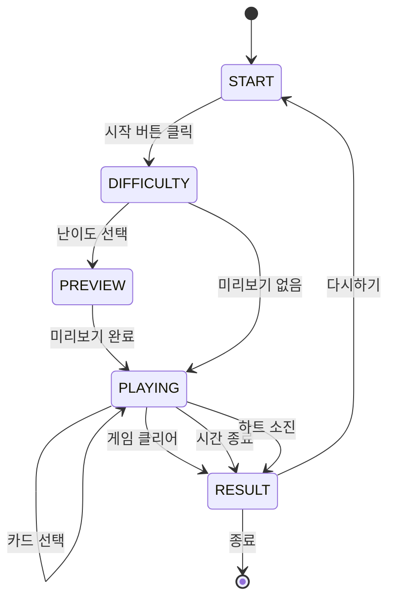
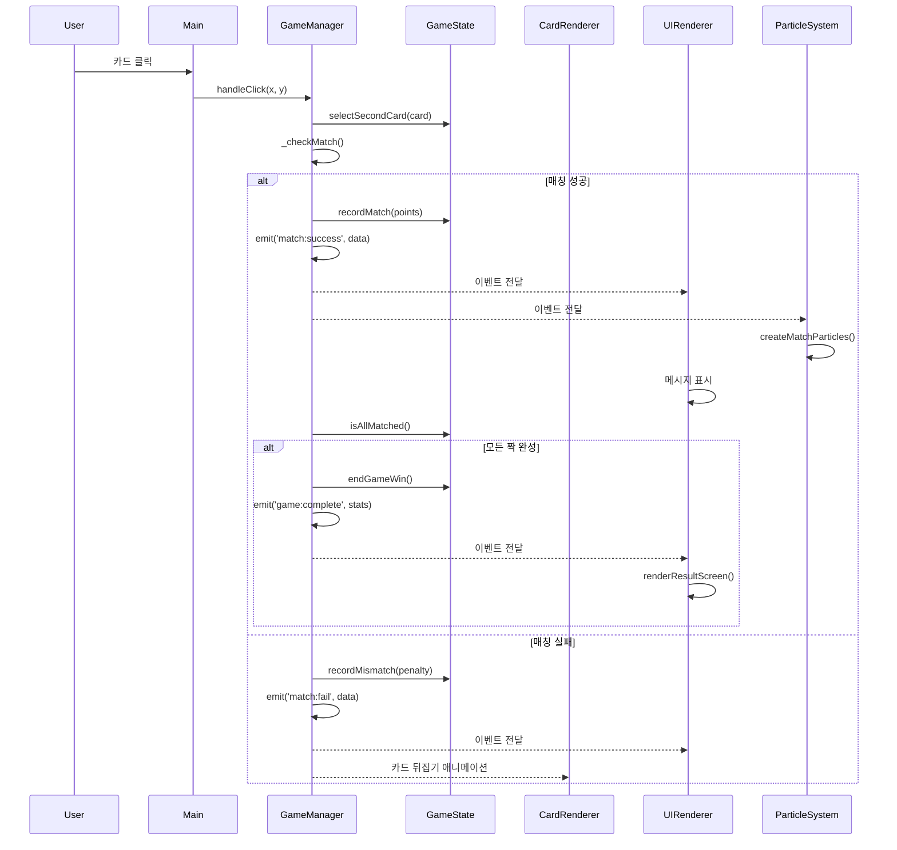
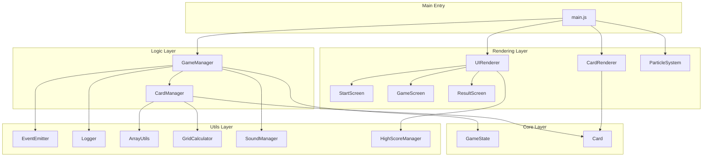
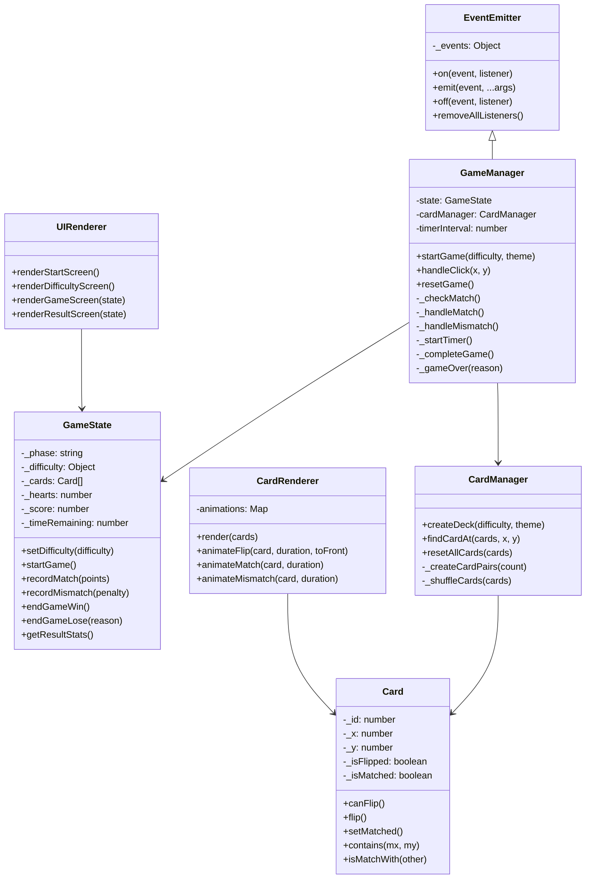

# Architecture Documentation

Card Matching Game의 시스템 아키텍처 및 설계 문서입니다.

## 목차
- [시스템 개요](#시스템-개요)
- [아키텍처 패턴](#아키텍처-패턴)
- [레이어 구조](#레이어-구조)
- [데이터 흐름](#데이터-흐름)
- [상태 관리](#상태-관리)
- [이벤트 시스템](#이벤트-시스템)
- [컴포넌트 다이어그램](#컴포넌트-다이어그램)

---

## 시스템 개요

Card Matching Game은 p5.js 기반의 메모리 카드 게임으로, **레이어드 아키텍처**와 **이벤트 기반 통신** 패턴을 사용합니다.

### 핵심 설계 원칙

1. **관심사의 분리 (Separation of Concerns)**
   - 데이터, 로직, 렌더링을 명확히 분리
   - 각 레이어는 독립적으로 테스트 가능

2. **단방향 데이터 흐름 (Unidirectional Data Flow)**
   - UI 이벤트 → Logic → State → Rendering
   - 예측 가능한 상태 변경

3. **이벤트 기반 통신 (Event-Driven Communication)**
   - 컴포넌트 간 느슨한 결합
   - EventEmitter 패턴 사용

4. **불변 상태 관리 (Immutable State)**
   - GameState는 읽기 전용 속성 제공
   - 상태 변경은 명시적 메서드를 통해서만 가능

---

## 아키텍처 패턴

### 1. Layered Architecture (레이어드 아키텍처)

```
┌─────────────────────────────────────┐
│         Main Entry Point            │  ← p5.js setup/draw
│          (main.js)                  │
└─────────────────────────────────────┘
              ↓
┌─────────────────────────────────────┐
│       Rendering Layer               │  ← UI 렌더링
│  (UIRenderer, CardRenderer, ...)   │
└─────────────────────────────────────┘
              ↓
┌─────────────────────────────────────┐
│        Logic Layer                  │  ← 비즈니스 로직
│  (GameManager, CardManager)         │
└─────────────────────────────────────┘
              ↓
┌─────────────────────────────────────┐
│         Core Layer                  │  ← 데이터 모델
│   (GameState, Card)                 │
└─────────────────────────────────────┘
              ↓
┌─────────────────────────────────────┐
│        Utils Layer                  │  ← 공통 유틸리티
│  (EventEmitter, Logger, ...)        │
└─────────────────────────────────────┘
```

### 2. MVC-Like Pattern (MVC 유사 패턴)

- **Model**: `GameState`, `Card` (Core Layer)
- **Controller**: `GameManager`, `CardManager` (Logic Layer)
- **View**: `UIRenderer`, `CardRenderer` (Rendering Layer)

### 3. Event-Driven Pattern (이벤트 기반 패턴)

```
GameManager (EventEmitter)
    ↓ emit events
UIRenderer (Listener)
```

---

## 레이어 구조

### Layer 1: Config & Utils

**목적**: 전역 설정 및 공통 유틸리티 제공

**파일들**:
- `config.js`: 난이도, 카드, 게임 상태 설정
- `utils/Logger.js`: 로깅 유틸리티
- `utils/EventEmitter.js`: 이벤트 기반 통신
- `utils/ArrayUtils.js`: 배열 처리 (셔플 등)
- `utils/GridCalculator.js`: 그리드 레이아웃 계산
- `utils/SoundManager.js`: 효과음 관리
- `utils/HighScoreManager.js`: 점수 기록 관리

**의존성**: 없음 (최하위 레이어)

---

### Layer 2: Core (데이터 모델)

**목적**: 게임의 핵심 데이터 구조 정의

**파일들**:
- `core/Card.js`: 카드 데이터 모델
- `core/GameState.js`: 게임 상태 모델

**의존성**: Config & Utils

**특징**:
- 순수 데이터 클래스
- 렌더링 로직 없음
- 비즈니스 로직만 포함

**Card 클래스 책임**:
```javascript
class Card {
    // 데이터 속성
    - id, x, y, imagePath
    - isFlipped, isMatched, isAnimating

    // 비즈니스 로직
    - canFlip(): 뒤집기 가능 여부
    - flip(): 카드 뒤집기
    - isMatchWith(other): 짝 확인
    - contains(mx, my): 클릭 감지
}
```

**GameState 클래스 책임**:
```javascript
class GameState {
    // 게임 페이즈 관리
    - phase, isPlaying(), isGameOver()

    // 게임 데이터
    - difficulty, cards, hearts, score, time

    // 통계 관리
    - attempts, successCount, failCount, combo

    // 상태 변경 메서드
    - setDifficulty(), startGame()
    - recordMatch(), recordMismatch()
    - endGameWin(), endGameLose()
}
```

---

### Layer 3: Logic (비즈니스 로직)

**목적**: 게임 규칙 및 카드 관리 로직

**파일들**:
- `logic/CardManager.js`: 카드 생성/관리
- `logic/GameManager.js`: 게임 로직 (핵심)

**의존성**: Core, Utils

**CardManager 책임**:
```javascript
class CardManager {
    // 카드 덱 생성
    - createDeck(difficulty, theme)

    // 카드 검색
    - findCardAt(cards, x, y)

    // 카드 상태 관리
    - resetAllCards(cards)
}
```

**GameManager 책임** (EventEmitter 상속):
```javascript
class GameManager extends EventEmitter {
    // 게임 생명주기 관리
    - startGame(difficulty, theme)
    - resetGame()
    - destroy()

    // 사용자 입력 처리
    - handleClick(x, y)

    // 게임 로직
    - _checkMatch()
    - _handleMatch(), _handleMismatch()
    - _completeGame(), _gameOver()

    // 타이머 관리
    - _startTimer(), _stopTimer()

    // 이벤트 발생
    - emit('game:init', ...)
    - emit('match:success', ...)
    - emit('game:complete', ...)
}
```

---

### Layer 4: Rendering (UI 렌더링)

**목적**: 게임 화면 렌더링

**파일들**:
- `rendering/CardRenderer.js`: 카드 렌더링 및 애니메이션
- `rendering/UIRenderer.js`: UI 화면 렌더링 (메인)
- `rendering/screens/StartScreen.js`: 시작 화면
- `rendering/screens/GameScreen.js`: 게임 화면
- `rendering/screens/ResultScreen.js`: 결과 화면
- `rendering/ParticleSystem.js`: 파티클 효과

**의존성**: Logic, Core, Utils

**UIRenderer 책임**:
```javascript
class UIRenderer {
    // 화면 렌더링 (Screen 패턴)
    - renderStartScreen()
    - renderDifficultyScreen()
    - renderGameScreen(state)
    - renderResultScreen(state)

    // 공통 UI 요소
    - _renderBackground()
    - _renderDecorations()
    - _renderBearCharacter()
}
```

**CardRenderer 책임**:
```javascript
class CardRenderer {
    // 카드 렌더링
    - render(cards)

    // 애니메이션 관리
    - animateFlip(card, duration, toFront)
    - animateMatch(card, duration)
    - animateMismatch(card, duration)
    - animateHover(card, isHover)
}
```

---

### Layer 5: Main (진입점)

**목적**: p5.js와 통합, 게임 초기화

**파일**: `main.js`

**의존성**: 모든 레이어

**책임**:
```javascript
// p5.js 라이프사이클 훅
- setup(): 게임 초기화
- draw(): 렌더링 루프
- mousePressed(): 마우스 클릭
- mouseMoved(): 마우스 이동
- keyPressed(): 키보드 입력

// 인스턴스 생성
- gameState
- cardManager
- gameManager
- uiRenderer
- cardRenderer
- particleSystem

// 이벤트 리스너 등록
- gameManager.on('game:init', ...)
- gameManager.on('match:success', ...)
```

---

## 데이터 흐름

### 1. 게임 시작 플로우

```
사용자: 시작 버튼 클릭
    ↓
main.js: mousePressed()
    ↓
UIRenderer: handleStartClick()
    ↓
GameManager: startGame(difficulty)
    ↓
GameState: setDifficulty(difficulty)
    ↓
CardManager: createDeck(difficulty, theme)
    ↓
GameState: setCards(cards)
    ↓
GameManager: emit('game:init', ...)
    ↓
UIRenderer: 게임 화면 렌더링
```

### 2. 카드 클릭 플로우

```
사용자: 카드 클릭
    ↓
main.js: mousePressed()
    ↓
GameManager: handleClick(x, y)
    ↓
CardManager: findCardAt(cards, x, y)
    ↓
Card: canFlip() 확인
    ↓
CardRenderer: animateFlip(card, ...)
    ↓
Card: flip()
    ↓
GameState: selectFirstCard(card) 또는 selectSecondCard(card)
    ↓
[두 번째 카드 선택 시]
GameManager: _checkMatch()
    ↓
[매칭 성공]
GameManager: _handleMatch()
    ↓
GameState: recordMatch(points)
    ↓
GameManager: emit('match:success', ...)
    ↓
ParticleSystem: createMatchParticles(x, y)
    ↓
[모든 짝 완성]
GameManager: _completeGame()
    ↓
GameState: endGameWin()
    ↓
GameManager: emit('game:complete', stats)
    ↓
UIRenderer: renderResultScreen(state)
```

### 3. 매칭 실패 플로우

```
GameManager: _checkMatch()
    ↓
[매칭 실패]
GameManager: _handleMismatch()
    ↓
GameState: recordMismatch(timePenalty)
    ↓
GameState: hearts 감소
    ↓
[하트 > 0]
CardRenderer: animateMismatch(card1, card2)
    ↓
[지연 후]
CardRenderer: animateFlip(card1, false)
CardRenderer: animateFlip(card2, false)
    ↓
GameState: clearSelection()
    ↓
[하트 = 0]
GameManager: _gameOver('hearts')
    ↓
GameState: endGameLose('hearts')
    ↓
GameManager: emit('game:over', ...)
    ↓
UIRenderer: renderResultScreen(state)
```

---

## 상태 관리

### 상태 관리 전략

1. **중앙 집중식 상태**
   - `GameState` 클래스가 모든 게임 상태 관리
   - 단일 진실 공급원 (Single Source of Truth)

2. **불변 상태**
   - 상태는 private 속성 (`_property`)
   - 읽기 전용 getter 제공
   - 상태 변경은 명시적 메서드를 통해서만 가능

3. **상태 변경 추적**
   - 모든 상태 변경은 GameManager를 통해 이루어짐
   - EventEmitter를 통해 상태 변경 통지

### 상태 다이어그램



### 상태 전환 규칙

| 현재 상태 | 이벤트 | 다음 상태 | 조건 |
|----------|--------|----------|------|
| START | 시작 버튼 클릭 | DIFFICULTY | - |
| DIFFICULTY | 난이도 선택 | PREVIEW | previewTime > 0 |
| DIFFICULTY | 난이도 선택 | PLAYING | previewTime = 0 |
| PREVIEW | 미리보기 완료 | PLAYING | 자동 전환 |
| PLAYING | 모든 짝 완성 | RESULT | isAllMatched() |
| PLAYING | 시간 종료 | RESULT | timeRemaining <= 0 |
| PLAYING | 하트 소진 | RESULT | hearts <= 0 |
| RESULT | 다시하기 | START | - |

---

## 이벤트 시스템

### EventEmitter 패턴

GameManager는 EventEmitter를 상속하여 이벤트 기반 통신을 구현합니다.

```javascript
class EventEmitter {
    constructor() {
        this._events = {};
    }

    on(event, listener) {
        if (!this._events[event]) {
            this._events[event] = [];
        }
        this._events[event].push(listener);
    }

    emit(event, ...args) {
        if (this._events[event]) {
            this._events[event].forEach(listener => {
                listener(...args);
            });
        }
    }

    off(event, listener) {
        if (this._events[event]) {
            this._events[event] = this._events[event]
                .filter(l => l !== listener);
        }
    }
}
```

### 이벤트 카탈로그

#### Game Lifecycle Events

| 이벤트 | 발생 시점 | 페이로드 | 리스너 |
|--------|----------|----------|--------|
| `game:init` | 게임 초기화 | `{ difficulty, theme, cardCount }` | UIRenderer |
| `game:preview:start` | 미리보기 시작 | `{ duration }` | UIRenderer |
| `game:preview:end` | 미리보기 종료 | - | UIRenderer |
| `game:playing:start` | 게임 시작 | - | UIRenderer |
| `game:complete` | 게임 클리어 | `ResultStats` | UIRenderer, HighScoreManager |
| `game:over` | 게임 오버 | `{ reason, stats }` | UIRenderer |
| `game:reset` | 게임 리셋 | - | UIRenderer |

#### Card Events

| 이벤트 | 발생 시점 | 페이로드 | 리스너 |
|--------|----------|----------|--------|
| `card:flip` | 카드 뒤집기 | `Card` | SoundManager |
| `match:success` | 매칭 성공 | `{ card1, card2, points, combo }` | UIRenderer, ParticleSystem, SoundManager |
| `match:fail` | 매칭 실패 | `{ card1, card2, penalty }` | UIRenderer, SoundManager |

#### Timer Events

| 이벤트 | 발생 시점 | 페이로드 | 리스너 |
|--------|----------|----------|--------|
| `timer:update` | 매 초마다 | `{ remaining, elapsed }` | UIRenderer |

#### Heart Events

| 이벤트 | 발생 시점 | 페이로드 | 리스너 |
|--------|----------|----------|--------|
| `heart:lost` | 하트 소진 | `{ remaining, max }` | UIRenderer, SoundManager |

### 이벤트 흐름 다이어그램



---

## 컴포넌트 다이어그램

### 전체 시스템 구성



### 클래스 다이어그램 (핵심 클래스)



---

## 확장성 및 유지보수성

### 새로운 난이도 추가

1. `config.js`의 `DIFFICULTY` 객체에 추가
2. UIRenderer에서 버튼 렌더링 로직 추가
3. 특수 카드가 있다면 CardManager 수정

### 새로운 카드 테마 추가

1. `CardManager`의 테마 맵에 추가
2. 이모지 또는 이미지 경로 설정

### 새로운 특수 카드 추가

1. `Card` 클래스에 특수 카드 타입 추가
2. `CardManager`에서 특수 카드 생성 로직 구현
3. `GameManager`에서 특수 카드 처리 로직 추가

### 새로운 효과음/음악 추가

1. `SoundManager`에 사운드 추가
2. 해당 이벤트 리스너에서 재생

### 테스트 가능성

각 레이어는 독립적으로 테스트 가능:

```javascript
// GameState 단위 테스트 예제
describe('GameState', () => {
    it('should record match correctly', () => {
        const state = new GameState();
        state.setDifficulty(DIFFICULTY.EASY);
        state.recordMatch(10);

        expect(state.matchedPairs).toBe(1);
        expect(state.baseScore).toBe(10);
        expect(state.successCount).toBe(1);
    });
});

// GameManager 통합 테스트 예제
describe('GameManager', () => {
    it('should emit game:init event on start', (done) => {
        const gameManager = new GameManager(gameState, cardManager);

        gameManager.on('game:init', ({ difficulty }) => {
            expect(difficulty.name).toBe('하');
            done();
        });

        gameManager.startGame(DIFFICULTY.EASY);
    });
});
```

---

## 성능 최적화

### 렌더링 최적화

1. **애니메이션 관리**
   - `Map` 자료구조로 애니메이션 상태 관리
   - 진행도 기반 조건부 렌더링

2. **정적 요소 캐싱**
   - 구름, 물결 등 정적 요소는 한 번만 계산

3. **디버그 모드 분리**
   - 디버그 렌더링은 조건부로만 실행

### 메모리 관리

1. **리소스 정리**
   - `GameManager.destroy()` 메서드로 명시적 정리
   - 타이머 및 이벤트 리스너 해제

2. **이벤트 리스너 관리**
   - 페이지 언로드 시 모든 리스너 제거
   - 페이지 숨김 시 타이머 정지

---

## 추가 참고 자료

- [API Reference](API_REFERENCE.md)
- [프로젝트 개요](../PROJECT_OVERVIEW.md)
- [디자인 가이드](../DESIGN_GUIDE.md)
- [개발자 가이드](DEVELOPER_GUIDE.md)
