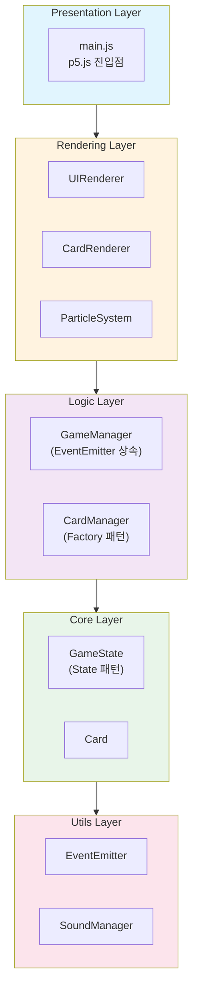
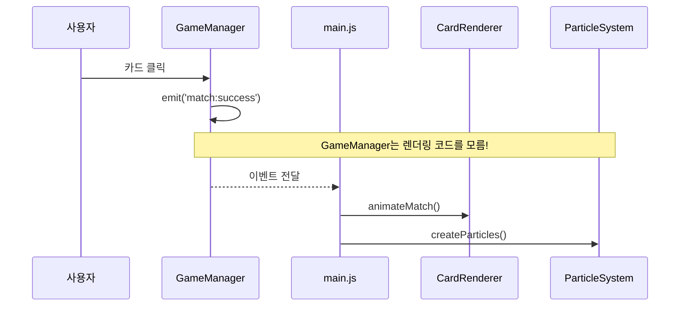
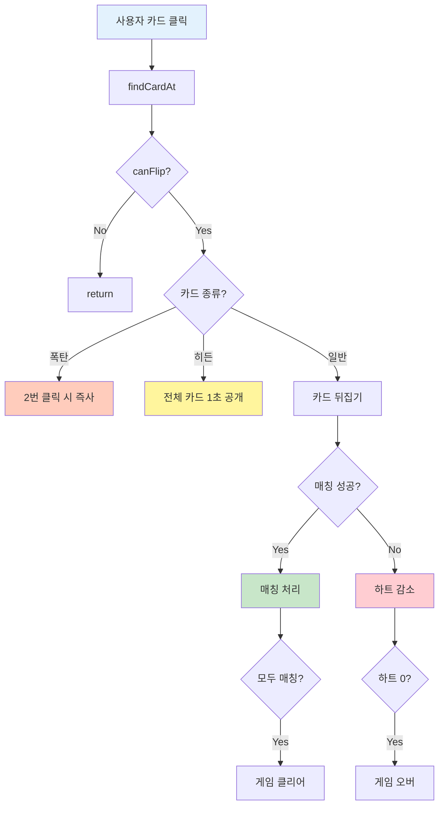

# 카드 매칭 게임 - 기술 발표 자료 (7분)

---

## 목차

1. [프로젝트 소개](#1-프로젝트-소개)
2. [p5.js 게임 루프](#2-p5js-게임-루프)
3. [아키텍처 설계](#3-아키텍처-설계)
4. [게임 동작 원리](#4-게임-동작-원리)

---

## 1. 프로젝트 소개

### 기술 스택

| 분류 | 기술 | 용도 |
|------|------|------|
| **프레임워크** | p5.js 1.7.0 | 캔버스 기반 그래픽/애니메이션 |
| **언어** | Vanilla JavaScript (ES6+) | 순수 JS, 외부 프레임워크 없음 |
| **디자인 패턴** | Observer, Factory, State | 느슨한 결합, 확장성 |
| **아키텍처** | Layered Architecture | 계층 분리, 단방향 의존 |

### 프로젝트 규모

- **총 19개 JavaScript 파일**
- 5개 계층: Presentation → Rendering → Logic → Core → Utils

### 게임 특징

| 기능 | 설명 |
|------|------|
| **4단계 난이도** | 하(8장) / 중(16장) / 상(30장) / 지옥(57장) |
| **특수 카드** | 히든 카드(보너스), 폭탄 카드(페널티) |
| **3장 매칭** | 지옥 모드 전용 규칙 |

---

## 2. p5.js 게임 루프

### 게임의 심장: setup() & draw()

```javascript
function setup() {
    createCanvas(1280, 720);  // 캔버스 생성 (1회 실행)
    imageMode(CENTER);         // 이미지 중심 기준
}

function draw() {
    background(240);           // 매 프레임 배경 클리어
    // 게임 렌더링 (60fps 자동 반복)
}

function mouseClicked() { /* 클릭 이벤트 */ }
```

**핵심 개념**:
- **setup()**: 게임 초기화 (1회 실행)
- **draw()**: 게임 루프 (60fps 자동 호출)
- **이벤트 핸들러**: 사용자 입력 처리

### 카드 뒤집기 애니메이션

```javascript
push();
translate(card.x, card.y);           // 카드 중심으로 이동
scale(cos(flipProgress * PI), 1);    // X축 스케일로 3D 효과
image(cardImage, 0, 0, width, height);
pop();
```

- **push()/pop()**: 변환 상태 저장/복원
- **scale(cos(...))**: cos 함수로 뒤집기 효과

---

## 3. 아키텍처 설계

### 계층형 아키텍처



**핵심 원칙**: 단방향 의존 (위 → 아래로만 참조)

### 적용된 디자인 패턴

| 패턴 | 적용 | 목적 |
|------|------|------|
| **Observer** | EventEmitter | 이벤트 기반 느슨한 결합 |
| **Factory** | CardManager | 난이도별 카드 덱 생성 |
| **State** | GameState | 게임 상태 머신 |

---

## 4. 게임 동작 원리

### 이벤트 흐름 (Observer 패턴)



**느슨한 결합**: GameManager는 이벤트만 발행, 렌더링은 리스너가 처리

### 카드 클릭 흐름도



### 특수 카드 시스템

| 카드 종류 | 효과 |
|----------|------|
| **히든 카드** | 매칭 시 모든 카드 1초간 공개 (역전 찬스) |
| **폭탄 카드** | 2번 클릭 시 즉시 게임 오버 (긴장감) |